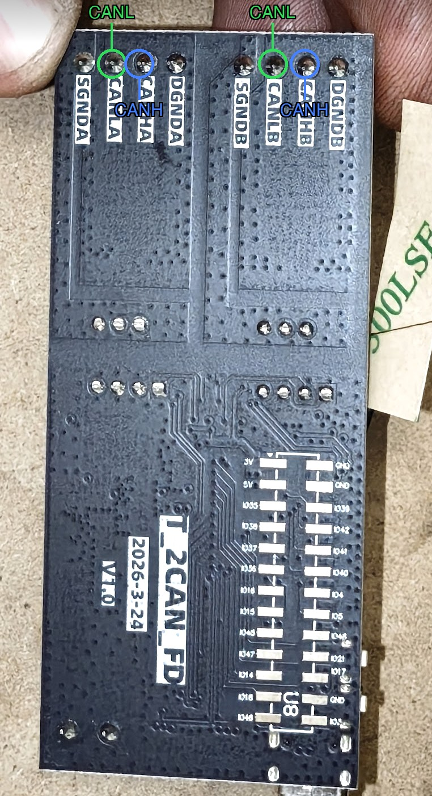
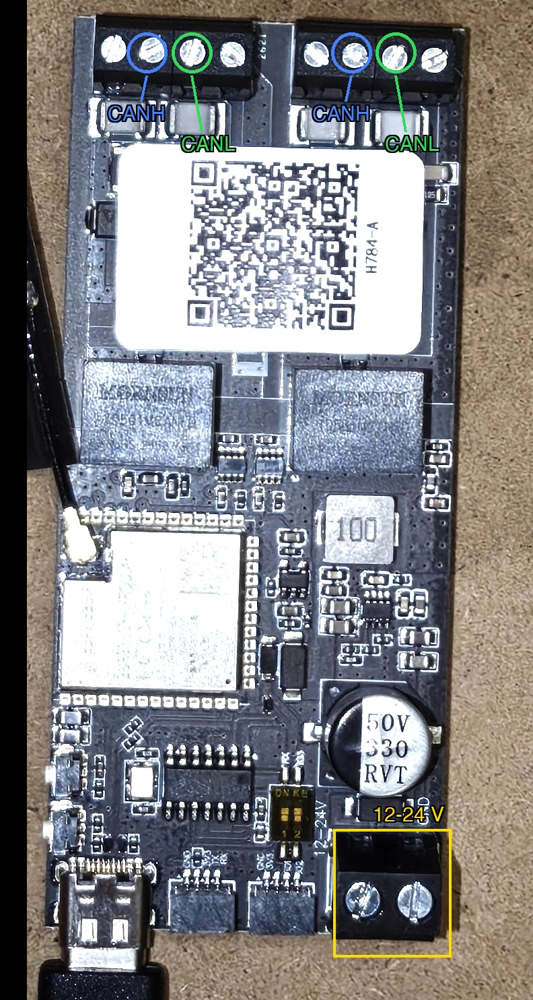

# Nissan LEAF / e-NV200 battery-upgrade CAN bridge (ESP32)

A clean ESP32 reimplementation of dalathegreat's battery-upgrade CAN bridge — the
job the Muxsan 3-port and STM32 2-port bridges do — for **both** the Nissan LEAF and
the e-NV200, in one binary, selectable at runtime. It sits between the car's VCM and
a bigger/newer battery, translating the pack's messages so the older car accepts it.

**This is a port of [dalathegreat](https://github.com/dalathegreat)'s GPL-3.0
battery-upgrade CAN bridges** — see [Credits & attribution](#credits--attribution).
All of the CAN translation logic comes from dala's work, with per-line source
references in the code comments; none of the underlying reverse-engineering
originates here.

## Credits & attribution

This project **ports / adapts the work of [dalathegreat](https://github.com/dalathegreat)**
(and contributors) to the ESP32. The hard part — reverse-engineering the Nissan battery
CAN protocol (message IDs, byte layouts, bit masks, checksums, GID/capacity spoofing,
DTC-clearing frames, generation/battery auto-detection) — is **theirs**, not ours. This
repo only re-implements that logic on new hardware.

Source material (© their respective authors):
- **Nissan LEAF Battery Upgrade** — https://github.com/dalathegreat/Nissan-LEAF-Battery-Upgrade (**GPL-3.0**). The LEAF translation here is ported from its `Software/CANBRIDGE-3port/leaf-can-bridge-3-port` firmware.
- **Nissan e-NV200 Battery Upgrade** — https://github.com/dalathegreat/Nissan-env200-Battery-Upgrade (**GPL-3.0**). The e-NV200 translation is ported from its `leaf-can-bridge-3-port-env200` firmware.
- **leaf_can_bus_messages** — https://github.com/dalathegreat/leaf_can_bus_messages (**GPL-3.0**) — CAN signal (DBC) definitions used as reference.
- **EV-CANlogs** — https://github.com/dalathegreat/EV-CANlogs — real captured CAN logs used for reference/validation.
- **Battery-Emulator** — https://github.com/dalathegreat/Battery-Emulator (**GPL-3.0**). The
  dashboard's LeafSpy-style battery diagnostic polling (`src/leaf_diag.*` — 0x79B/0x7BB group
  requests, cell-voltage/shunt/temperature/identity parsing, the `Temp_fromRAW_to_F()`
  conversion) is ported from its `Software/src/battery/NISSAN-LEAF-BATTERY.cpp`.
- dala's bridges were developed together with **Muxsan**'s 3-port CAN-bridge hardware.

Also referenced / thanks to:
- **NismoBoy34 / Esp32LeafInverterBridge** — the prior ESP32 attempt that prompted this project. Its battery-upgrade translation was never implemented, so the logic here is re-ported directly from dala rather than taken from it.
- **LilyGo T-2CANFD** board pinout — from [Xinyuan-LilyGO/T-2Can](https://github.com/Xinyuan-LilyGO/T-2Can).
- **ACAN2517FD** MCP2518FD driver library by Pierre Molinaro.
- **Longan_CANFD** — https://github.com/Longan-Labs/Longan_CANFD — MCP2518FD library used during development to cross-check controller configuration (e.g. the 20 MHz oscillator setting, via LilyGo's example).

The code comments carry per-handler source line references (e.g. `// L523-736`) so every
value can be traced back to dala's original file and line.

## ⚠️ Safety
This controls a real vehicle. It has been **compile-verified** and the translation was
**independently cross-checked against dala's source**, but it has **not been tested on
hardware or in a car**. First bring-up must be on a bench (CAN analyzer / replayed
logs), then in-car with the ability to revert to a plain pass-through.

## Hardware — LilyGo T-2CANFD (ESP32-S3)

The board has **two galvanically-isolated CAN ports**. The bridge is installed **inline
in the Nissan EV-CAN bus, between the vehicle and the battery** (dala: *"mounted between
the battery and vehicle EV-CAN system"*). You cut the EV-CAN bus and connect one segment
to each port. Both segments are classic **CAN 2.0B @ 500 kbit/s**.

### Wiring diagram

```text
        Nissan EV-CAN bus (classic CAN 2.0B, 500 kbit/s)
        ── cut the bus and insert the bridge inline ──

   VEHICLE segment                                  BATTERY segment
   (VCM, cluster, charger)                          (new pack: LBC / BMS)
          │  │                                              │  │
      CANH│  │CANL                                      CANH│  │CANL
     (L = │  │ (G =                                    (L = │  │ (G =
     blue)│  │green)*                                  blue)│  │green)*
          │  │                                              │  │
        pin 2  pin 3                                     pin 2  pin 3
   ┌──────┴──┴───── LilyGo T-2CANFD — the two GREEN ────────┴──┴──────┐
   │              4-pin 3.81 mm terminal blocks (P1 / P2)             │
   │   ┌────────────────────┐              ┌───────────────────────┐  │
   │   │ P1: CAN-B (TWAI)   │   ESP32-S3   │ P2: CAN-A (MCP2518FD) │  │
   │   │ isolated           │              │ isolated, 20 MHz      │  │
   │   └────────────────────┘              └───────────────────────┘  │
   │                                                                  │
   └───────────────────────────────┬──────────────────────────────────┘
                                    │
       2-pin 5.08 mm terminal:      │
                 VIN 12–24 V (+) ───┤   ← car switched 12 V accessory
                 GND (−)         ───┘     (USB-C 5 V = bench/flashing only)

   * Nissan code L = blue, G = green — LEAF harness colors at the VCM per the 2015
     US-market LEAF service manual (SM15EA0ZE0U0). Colors are not uniform on every
     branch of the harness; confirm the pair electrically before cutting.
```

Photos of the actual board (T_2CAN_FD V1.0):

**Underside — every CAN screw is named next to its solder pad.** Wire by these
printed labels, not by position. One block is port A
(`DGNDA · CANHA · CANLA · SGNDA`), the other port B
(`DGNDB · CANHB · CANLB · SGNDB`); which one faces vehicle vs battery doesn't
matter — the firmware auto-detects.



**Top — the two black 4-pin screw blocks (top edge) are the CAN ports.** At the
opposite end: USB-C (bench/flashing), the two small JST sockets (UART/GPIO — not
CAN, leave empty), the `12–24V` power screw terminal with `GND` marked beside it,
and a 2-position DIP switch (not in the vendor schematic — function unverified,
leave as shipped).



**Oscillator auto-detection.** The MCP2518FD crystal is either 20 MHz or 40 MHz
depending on the board, and the wrong choice halves or doubles CAN-A's bit rate so
it hears nothing. The firmware sorts this out itself: on first run it alternates
trial configurations until real frames arrive, prints `[can_a] oscillator
auto-detected: 40 MHz`, and stores the result, so every later boot goes straight to
`[can_a] using saved 40 MHz oscillator`. The trials only listen and acknowledge —
they never transmit, so detection is safe on a live bus. Detection keeps waiting
harmlessly if CAN-A is silent, and CAN-B, the web dashboard and the rest of the
bridge are unaffected throughout.

## Web dashboard
The bridge runs a WiFi soft-AP + live telemetry dashboard, no phone app or toolchain
needed:

- **Connect to WiFi**: SSID `CANBRIDGE`, password `canbridge123`.
- **Open** <http://10.0.0.1:8080> in a phone or laptop browser. The explicit `:8080` port stops browsers from silently upgrading the address to HTTPS (which the bridge cannot serve); plain <http://10.0.0.1> also works in browsers that allow http. The AP answers the OS connectivity checks, so phones treat it as a normal network and route to the bridge over WiFi.

Features:
- Status bar: vehicle (LEAF/e-NV200), car state (Idle/Driving/Charging/Asleep), which
  bus is the battery, WebSocket connection state, uptime.
- Battery tiles: SOC, GIDs/kWh, SOH, pack voltage/current/power, temperature,
  charge/discharge power limits, relay/failsafe status, DTC.
- Drive tiles: speed (approx), gear, ECO, torque, inverter voltage.
- Rolling ~60 s sparkline charts for power, SOC, and temperature.
- **Battery cells** section: polls the LBC the same way a LeafSpy OBD dongle does
  (0x79B/0x7BB diagnostic groups), one group per ~3 s — all 96 cell voltages,
  balancing-shunt status, pack temperatures, Hx, insulation resistance, and the
  battery's part number/serial/BMS ID. Auto-pauses for 60 s whenever a real
  LeafSpy/OBD tool is seen polling the bus, to avoid two ISO-TP conversations
  colliding on the same request ID.
- Frame monitor: live per-ID rate/count/payload tables for both CAN buses.
- **Custom CAN transmit** panel (battery / vehicle / raw bus A / raw bus B), behind an
  "Arm transmit" toggle.

  > ⚠️ **Transmitting on a live vehicle bus can trigger faults or unsafe behavior.**
  > Only use the custom-TX panel when you understand the frame you're sending — this
  > talks directly to the EV-CAN in a car.

The dashboard is a single embedded page (no filesystem/SD card involved) served
straight from flash; the telemetry tap (`src/telemetry.*`) only reads frames on the
bridge's existing forwarding path and never modifies them, and all dashboard-originated
CAN transmits are queued and sent from the main loop task (`webui_drain_tx()`), never
from the WiFi/web task — the CAN drivers are not thread-safe.

## Selecting the vehicle
Choice is stored in NVS and read once at boot (never swapped mid-run). Over the serial
monitor (115200) send `leaf` or `env200`, then reboot. Default is LEAF.

## Code layout
```
include/board_pins.h      verified T-2CANFD pin map
src/can_frame.h           neutral BridgeFrame + bus identity
src/can_bus.{h,cpp}       the ONLY hardware-specific layer (TWAI + MCP2518FD)
src/bridge.{h,cpp}        forwarding core + translate() dispatch + block via return false
src/vehicle_config.{h,cpp} runtime LEAF/e-NV200 selection (NVS-persisted)
src/nissan_crc.{h,cpp}    CRC-8 (0x85) + calc_sum2 / calc_checksum4
src/leaf_5bc.h            0x5BC model + pack/unpack
src/leaf_5c0.h            0x5C0 temperature model + pack
src/leaf_translation.{h,cpp}    full LEAF battery-upgrade translation
src/env200_translation.{h,cpp}  e-NV200 (24→40 kWh) translation
src/telemetry.{h,cpp}     read-only decoded-state tap for the web dashboard
src/leaf_diag.{h,cpp}     LeafSpy-style battery diagnostic polling (0x79B/0x7BB) for the dashboard
src/webui.{h,cpp}         WiFi soft-AP + async web server/WebSocket + CAN-TX queue
src/webui_page.h          embedded dashboard HTML/CSS/JS (PROGMEM)
src/main.cpp              setup() / loop() + boot self-test
```
Design: all battery-upgrade logic lives behind `translate()`; the driver and
forwarding code never change as features are added. Generated frames are injected onto
the auto-detected battery bus; the block list drops frames via `return false`.

## Architecture faithfulness (vs dala 3-port)
- dala forwards a received frame to the *other* bus unless blocked → same here.
- dala injects generated frames to `battery_can_bus` → here via `canbus_send(battery_bus,…)`.
- dala's 3rd port is `#define DISABLE_CAN3` by default → a 2-bus bridge matches the
  default configuration.
- dala's software TX FIFO works around an MCP25625 erratum; the MCP2518FD/TWAI drivers
  have their own TX queues and no such erratum.

## Flash from the browser (no toolchain)
Open **<https://uzef1x.github.io/CANBRIDGE/>** in Chrome or Edge, plug the board in
over USB-C, pick a release and click Install. The page also selects the vehicle
(LEAF / e-NV200) over Web Serial after flashing. Images are built by CI on every
`v*` tag and published to `images/<version>/`.

## Build / flash (PlatformIO)
```
pio run -e lilygo-t2canfd              # compile
pio run -e lilygo-t2canfd -t upload    # flash over USB-C
pio device monitor -b 115200           # boot log, self-test, A->B / B->A counters
```
Plain Arduino C++ — also builds in the Arduino IDE (ESP32-S3 board + ACAN2517FD lib).

## License

This project is a derivative work of dalathegreat's **GPL-3.0** battery-upgrade bridges,
so it is released under the **GNU General Public License v3.0** — see [LICENSE](LICENSE).
If you use, modify, or distribute it, you must preserve the attribution above and keep it
GPL-3.0. This is required by dala's license and is the right thing to do — the credit for
this work belongs with them.
